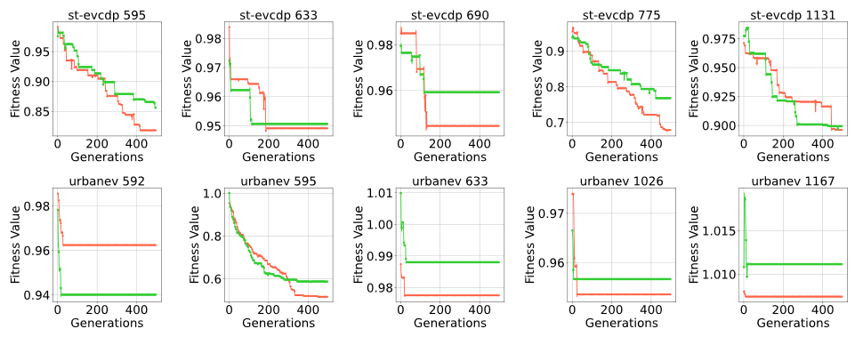

<div align="center">
<h1>Genetic Algorithm - EV Least Recently Used</h1>



This study proposes a probability estimation model based on charging pile data and constructs nine scenario-specific battery swap demand datasets. An innovative approach by combining the Least Recently Used (LRU) strategy with genetic algorithms and incorporating a guided search mechanism, which effectively enhances the global optimization capability.
</div>

## News
- **2025-04-08:** Paper and code are all released.

## Our BSS datasets
The description for our bss datasets is as follow: 

| Name       	 | E-Price 	| Our Estimated Data 		   | Orginal Data									   					   |
| :------------- | :------: | :--------------------------- | :------------------------------------------------ 					   |
| acn            | ×        | `demand.csv`, `bss.csv`      | [EV-Load-Open-Data](https://github.com/yvenn-amara/ev-load-open-data) |
| boulder_2021   | ×        | `demand.csv`, `bss.csv`      | [EV-Load-Open-Data](https://github.com/yvenn-amara/ev-load-open-data) |
| dundee         | ×        | `demand.csv`, `bss.csv`      | [EV-Load-Open-Data](https://github.com/yvenn-amara/ev-load-open-data) |
| palo_alto      | ×        | `demand.csv`, `bss.csv`      | [EV-Load-Open-Data](https://github.com/yvenn-amara/ev-load-open-data) |
| paris          | ×        | `demand.csv`, `bss.csv`      | [EV-Load-Open-Data](https://github.com/yvenn-amara/ev-load-open-data) |
| perth          | ×        | `demand.csv`, `bss.csv`      | [EV-Load-Open-Data](https://github.com/yvenn-amara/ev-load-open-data) |
| sap            | ×        | `demand.csv`, `bss.csv`      | [EV-Load-Open-Data](https://github.com/yvenn-amara/ev-load-open-data) |
| st-evcdp       | √        | `demand.csv`, `bss.csv`      | [ST-EVCDP](https://github.com/IntelligentSystemsLab/ST-EVCDP) 		   |
| urbanev        | √        | `demand.csv`, `bss.csv`      | [UrbanEV](https://github.com/IntelligentSystemsLab/UrbanEV) 		   |

We provide a battery swapping demand dataset generated by the conversion of the [ST-EVCDP](https://github.com/IntelligentSystemsLab/ST-EVCDP), [UrbanEV](https://github.com/IntelligentSystemsLab/UrbanEV), and [EV-Load-Open-Data](https://github.com/yvenn-amara/ev-load-open-data), consisting of a total of 9 folders, each folder containing unstructured demand data demand.csv and data normalized to 1 hour bss.csv. You can download the raw data from [Google Drive Link](https://drive.google.com/drive/folders/1rz6EGdvIIXo9fobnQkJlD2SdbtNeZ_BH?usp=sharing). Or download the original dataset and run our algorithm.

## Getting Started

We recommend setting up a conda environment:

```shell
conda create -n GA_EVLRU python=3.9 -y
conda activate GA_EVLRU
```
Installing the required packages:

```shell
pip install -r requirements.txt
```

## Running GA-EVLRU

### Linux
```shell
git clone https://github.com/qingshufan/GA-EVLRU.git
cd ga-evlru
./run.sh
```

### Windows
```shell
git clone https://github.com/qingshufan/GA-EVLRU.git
cd ga-evlru
./run.bat
```

This script is designed to run GA-EVLRU quickly. 
Firstly, from the [ST-EVCDP](https://github.com/IntelligentSystemsLab/ST-EVCDP), [UrbanEV](https://github.com/IntelligentSystemsLab/UrbanEV), and [EV-Load-Open-Data](https://github.com/yvenn-amara/ev-load-open-data) project download raw dataset.
Secondly, run the estimation algorithm to generate an estimation dataset, run the GA-EVLRU algorithm to generate comparison results.
Finally, run multiple scripts to generate evaluation metrics results.

## LICENSE

The ST-EVCDP dataset is under the MIT license. The UrbanEV dataset is under the CC0 1.0 Universal License.  The EV Load Open Data dataset is under the GPL-3.0 license. And Our GA-EVLRU are under the GPL-3.0 license.

## Citation

If you find this project useful, please consider citing:
```bibtex

```